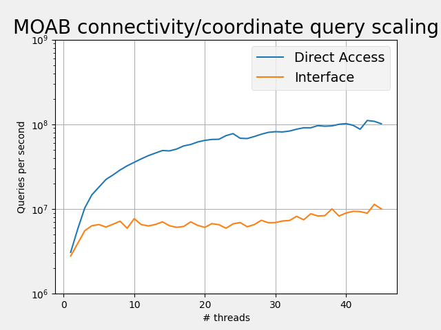
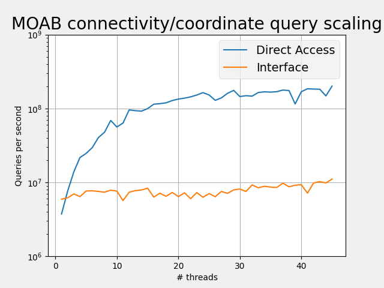

## Summary

This quick and dirty repo is intended for use in comparing the scaling of MOAB
element connectivity and coordinate queries in a threaded programming model.

The `Makefile` will build two executables. One which performs random queries using the standard MOAB interface (`interface`) and another which uses the DirectAccess methods in MOAB to access the same data (`direct_acess`).

## Building the executables

All that is required is a system with support for OpenMP and a MOAB installation. The location of the MOAB installation can be speficied in the `make` command:

```bash
$ make MOAB_DIR=/path/to/moab/installation
```

or as an environment variable

```bash
$ export MOAB_DIR=/path/to/moab/installation
$ make
```

## Executable options

The following options are applicble to both of the executables.

  - `-w` : write a binary file containing the entity queried, its connectivity, and the coordinates of its vertices

## Scripts and Visualization

Below is a breif description of the files in the `scripts` directory:

  - `run_comparison.sh` - a script which will run each executable repeatedly for
    different numbers of threads starting with 1 and ending at `MAX_THREADS`, a variable specified in the script
  - `viz.py` - a file which will produce a simple visualization of the results from `run_comparision.sh`

## Sample DAGMC Files:

Below are links to two models commonly used for benchmarking DAGMC performance:

  - [Frascati Neutron Generator (FNG)](https://anl.box.com/shared/static/2nmrf3vpu1n8bpcadjqaf884vc65y8h5.h5m)
  - [Advanced Test Reactor (ATR)](https://anl.box.com/shared/static/w57ambhcijysdns573jnor4215zg28mh.h5m)


## Initial Results

The following tests were performed with Intel(R) Xeon(R) Platinum 8260 CPU @ 2.40GHz with 96 cores.

### ATR



### FNG

